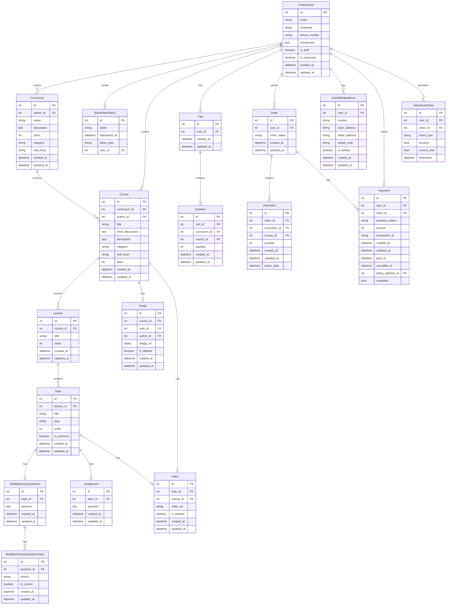
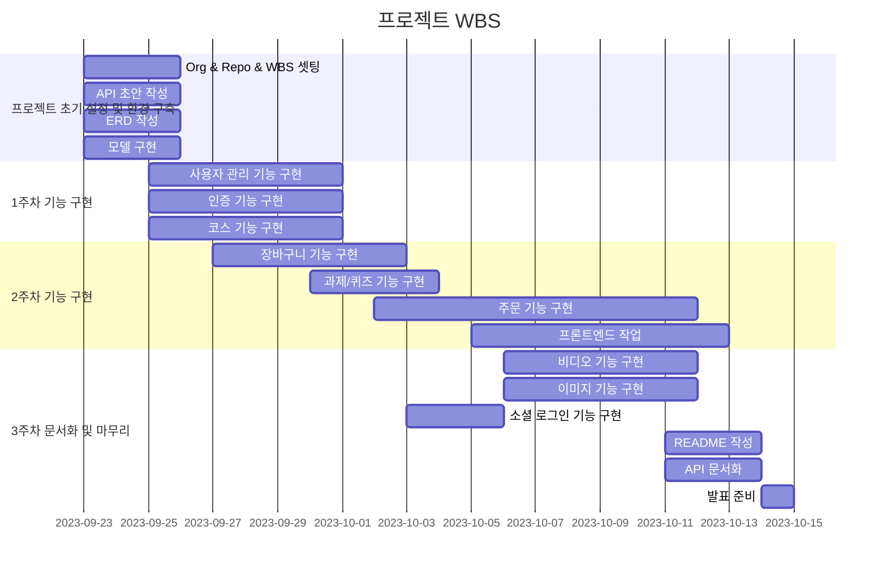

# 프로젝트

## 소개
본 프로젝트는 온라인 영상 교육 플랫폼을 구현하기 위한 프로젝트입니다.

본 프로젝트의 목표는 온라인 영상 교육 플랫폼을 구축하여 사용자들에게 접근성 높은 ICT 교육 기회를 제공하고, 이를 통해 디지털 역량 강화와 경력 개발을 지원하는 비즈니스 가치를 창출하는 것입니다. 특히 웹 개발 나노 디그리 과정을 통해 실무 중심의 체계적인 학습 경험을 제공하고, 사용자 맞춤형 학습 관리 시스템으로 효과적인 학습을 도모하며, 결제 시스템 통합으로 수익 모델을 확립하는 것입니다. 

본 프로젝트명의 Weaverse는 Weave + Universe의 합성어로 Weave는 여러 ICT 과목들이 서로 연결되어 하나의 완성된 교육과정을 만드는 특성을, Universe는 플랫폼이 제공하는 다양한 학습 기회와 Resources를 상징하며 광범위하고 포괄적인 환경을 의미합니다. 여러분이 ICT 교육 프로그램을 통해 강좌에서 배운 ICT 내용을 통해 프로젝트에서 새로운 것을 만들어낼 수 있기를 바랍니다. 

## 일정
- 기간: 2024.09.23 ~ 2024.10.14 (22일)
- 주차별 일정:   
**1주차: 09.23 ~ 09.29**   
(09.23 ~ 09.25) 프로젝트 초기 설정 및 환경 구축, 기록 환경 구축  
(09.26 ~ 09.29) 기능 구현 1  
**2주차: 09.30 ~ 10.06**    
(09.30 ~ 10.6) 기능 구현 2
(09.30 ~ 10.6) 테스트 및 버그 수정  
**3주차: 10.07 ~ 10.13**    
(09.30 ~ 10.10) 기능 구현 3  
(09.30 ~ 10.10) 테스트 및 버그 수정  
(09.30 ~ 10.13) 프론트엔드 작업, 최종 검토 및 문서화  


## 사전 협의사항

### 1 개발 환경

#### 1-1 사용하는 기술 스택 (프론트엔드)

| 카테고리 | 영역 | 기술 |
|:----------:|:------:|:------|
| 프론트엔드 | JS 프레임워크 |  |
| 프론트엔드 | CSS 프레임워크 |  |
| 프론트엔드 | API 통신 |  |

#### 1-2 사용하는 기술 스택 (백엔드)

| 카테고리 | 영역 | 기술 |
|:----------:|:------:|:------|
| 백엔드 | 웹 프레임워크 |   |
| 백엔드 | 데이터베이스 |   |
| 백엔드 | API 개발 |   |
| 백엔드 | 서비스 배포 환경 |     |


#### 1-3 사용하는 기술 스택 (배포)

| 카테고리 | 영역 | 기술 |
|:----------:|:------:|:------|
| 자동화 | CI/CD |  |
| 문서화 | API 문서화 |  |

#### 1-4 사용하는 협업 툴

| 카테고리 | 영역 | 기술 |
|:----------:|:------:|:------|
| 협업툴 | 소통 |   |
| 협업툴 | 기록 |   |


##### **기록 환경**
* Project: WBS, GroundRule, Convention, 공유할 내용(링크, 개발환경, 공유파일 변경 내역), 회의록(TODO)
* Discussion: 안건, 토의 및 결론
* PR: 코드 리뷰 및 피드백
* Wiki: 주간 및 일일 회고록, Project & Discussion & PR 정리 블로그

#### 1-5 VS Code Extension
Black Formatter
isort
Docker
PostgreSQL
Thunder Client

#### 1-6 기본 및 써드 파티 라이브러리

1. 웹 프레임워크 및 REST API
```
CSRF
Django, djangorestframework: 웹 애플리케이션 개발 및 RESTful API 구현
django-cors-headers: 크로스 오리진 리소스 공유(CORS) 설정
django-filter: API 쿼리 필터링
drf-spectacular, drf-yasg: API 문서화
```

2. 데이터베이스 및 ORM
```
psycopg, psycopg-binary: PostgreSQL 데이터베이스 어댑터
```

3. 인증 및 권한
```
dj-rest-auth, django-allauth: 사용자 인증 및 등록
social-auth-app-django, social-auth-core: 소셜 미디어 인증
PyJWT: JSON Web Token 처리
```

4. 파일 및 미디어 처리
```
django-storages, boto3, botocore: AWS S3와 같은 클라우드 스토리지 통합
Pillow: 이미지 처리
django-video-encoding, ffmpeg, ffmpeg-python, ffprobe, moviepy: 비디오 처리 및 인코딩
opencv-python: 컴퓨터 비전 작업
```

5. 테스트 및 개발 도구
```
pytest, pytest-django: 테스트 프레임워크
model-bakery, Faker: 테스트 데이터 생성
mypy: 정적 타입 검사
django-seed: 데이터베이스 시드 데이터 생성
```

6. 유틸리티 및 헬퍼 라이브러리
```
python-dotenv: 환경 변수 관리
requests: HTTP 요청 처리
numpy: 수치 계산
tqdm: 진행 막대 표시
```

7. 서버 및 배포
```
gunicorn: WSGI HTTP 서버
```

8. 데이터 직렬화 및 스키마
```
PyYAML: YAML 파싱 및 생성
jsonschema: JSON 스키마 검증
```

9. 시간 및 날짜 처리
```
pytz: 시간대 처리
python-dateutil: 날짜 및 시간 유틸리티

```

### 2 아키텍쳐
- 그림 삽입
 
### 3 요구사항 명세

요청하신 대로 마크다운 표를 작성해 드리겠습니다.

#### 3-1 기능적 요구사항

| 요구 기능 | 요구 기능 내용 | 구현 완료 |
|:-----------|:----------------|:---:|
| 1. 사용자 관리 (필수) | - 회원가입, 로그인/로그아웃 (사용자 및 관리자)<br>- 사용자 프로필 관리 (수료증, 학점, 학습 시간 등) | V |
| 2. 과목 관리 (필수) | - 7개 기본 과목 구성 (웹 개발 나노 디그리)<br>- 메인 페이지에 로드맵 표시 (결제 상태에 따른 색상 구분) | V |
| 3. 학습 진행 관리 | - 관리자 대시보드 (접속자 수, 결제 내역, 진행률 등)<br>- 학습자 대시보드 (개인 학습 진행 상황, 미션 현황) | V |
| 4. 동영상 학습 시스템 (필수) | - 비디오 스트리밍 기능 (기본 컨트롤, 진행률 표시, 이어보기) | V |
| 5. 미션 및 평가 시스템 (필수) | - 과목별 중간, 기말 미션 (5지선다형, 코드 제출형)<br>- 자동 채점 기능 | V |
| 6. 수료 인증 시스템 | - 디지털 수료증 발급 및 다운로드 | |
| 7. 결제 시스템 | - 다양한 결제 방식 지원<br>- 통합 결제 금액: 50,000원, 수강 기간 2년 | V |
| 8. ChatGPT 질문 응답 서비스 | - 강의 재생 화면에 챗봇 형태로 구현 | |

#### 3-2 비기능적 요구사항

| 요구 기능 | 요구 기능 내용 | 구현 완료 |
|:-----------|:----------------|:---:|
| 9. 비기능적 요구사항 | - 성능: 동시 접속자 100명 이상, 페이지 로딩 3초 이내<br>- 보안: 개인정보 암호화 저장<br>- 확장성: 새로운 과목 추가 용이, 서버 확장 고려<br>- 사용성: 위니브 부트캠프와 유사한 디자인 적용 | |
| 10. 데이터 요구사항 | - 사용자 정보, 학습 진행 상황, 결제 정보 등 저장 및 관리<br>- 정기적인 데이터 백업 | |


### 4 구현할 기능 명세

#### accounts
- 회원가입 R (수강생)
- 회원가입 R (수강생/강사/관리자) - 관리자 페이지
- 회원목록 R
- 회원정보 CRUD(소프트 삭제) (수강생)
- 회원정보 CRUD(소프트 삭제) (강사)
- 회원정보 CRUD(소프트 삭제) (수강생/강사/관리자) - 관리자 페이지

#### jwtauth
- 로그인
- 로그아웃 
- 로그인 토큰 C(RTR기반) (재발급)
- 로그인 토큰목록 보관(blacklist)
- 로그아웃 토큰목록 보관(blacklist)
- 소셜 로그인 연동

#### courses
- 과목목록 R
- 과목 CRUD(소프트 삭제)

#### materials
- 이미지 CRUD(검증 및 최적화)
- 이미지목록 R
- 영상 CUD(검증 및 최적화)
- 영상목록 R
- 영상기록 CUD
- 영상기록 R

#### payments
- 장바구니 RUD
- 장바구니목록 R
- 주문 CR
- 주문 청구주소 CRUD
- 주문 청구주소목록 R
- 주문 C
- 주문 결제 C (카카오페이 연동)
- 주문 환불 D (카카오페이 연동)
- 영수증 R
- 영수증목록 R


### 5 API 구조


#### 5-1 사용자 (accounts)

##### 수강생(student)

| 엔드포인트     | 메서드 | 설명                                     | 비인증 | 사용자 | 튜터 | 관리자 |
| :-------------- | :------: | :-----------------------------------| :--: | :--: | :--: | :--: |
| `/admin/` | `POST` | 수강생, 튜터, 관리자 회원가입|O|
| `/api/student/register/` | `POST`    | 수강생 회원가입        |O| 
| `/api/password/reset/` | `POST`    | 사용자 비밀번호 재설정     ||O|O|O|
| `/api/students/`        | `POST`   | 수강생 목록 조회          ||O|O|O|    
| `/api/students/{id}`    | `GET`    | 수강생 정보 조회        ||O|O|O|
| `/api/students/{id}`    | `PUT`    | 수강생 정보 전체수정    ||O|O|O|
| `/api/students/{id}`    | `PATCH`    | 수강생 정보 부분수정  ||O|O|O|
| `/api/students/{id}`    | `DELETE` | 수강생 탈퇴               ||O|O|O|

##### 강사(tutor)

| 엔드포인트     | 메서드 | 설명                                     | 비인증 | 사용자 | 튜터 | 관리자 |
| :-------------- | :------: | :-----------------------------------| :--: | :--: | :--: | :--: |
| `/api/tutors/` | `GET`  | 튜터 목록 조회   | | | |O|
| `/api/tutors/{id}/` | `GET` | 튜터 정보 조회 | | |O|O|
| `/api/tutors/{id}/` | `PUT` | 튜터 정보 전체수정 | | |O|O|
| `/api/tutors/{id}/` | `PATCH` | 튜터 정보 부분수정 | | |O|O|
| `/api/tutors/{id}/` | `DELETE` | 튜터 탈퇴 | | |O|O|


#### 5-2 인증 (jwtauth)

| 엔드포인트     | 메서드 | 설명                                     | 비인증 | 사용자 | 튜터 | 관리자 |
| :-------------- | :------: | :-----------------------------------| :--: | :--: | :--: | :--: |
| `/api/login/`  | `POST` | 사용자 로그인 및 토큰 발급      |O|      
| `/api/logout/` | `POST` | 사용자 로그아웃                ||O|O|O|
| `/api/refresh/` | `POST` | 사용자 refresh token 발급     |O|O|O|O|
| `/api/social-login/google/` | `GET` | 사용자 소셜 로그인 |O|                |      |

#### 5-3 과목 (course)

##### 커리큘럼 (**curriculum**)

| 엔드포인트     | 메서드 | 설명                                     | 비인증 | 사용자 | 튜터 | 관리자 |
| :-------------- | :------: | :-----------------------------------| :--: | :--: | :--: | :--: |
| `/api/curriculums/`     | `POST`  | 커리큘럼 생성                        |||O|O|
| `/api/curriculums/`     | `GET`   | 커리큘럼 목록 조회                   |||O|O|
| `/api/curriculums/{id}` | `GET`   | 커리큘럼 정보 조회                   |||O|O|
| `/api/curriculums/{id}` | `PUT`   | 커리큘럼 정보 전체수정               |||O|O|
| `/api/curriculums/{id}` | `DELETE`| 커리큘럼 정보 삭제                   |||O|O|

##### 과목

| 엔드포인트     | 메서드 | 설명                                     | 비인증 | 사용자 | 튜터 | 관리자 |
| :-------------- | :------: | :-----------------------------------| :--: | :--: | :--: | :--: |
| `/api/courses/`               | `POST`  | 과목 생성                          |||O|O|    
| `/api/courses/`               | `GET`   | 과목 목록 조회                     |O|O|O|O|
| `/api/courses/{id}`           | `GET`    | 과목 정보 조회                    |O|O|O|O|
| `/api/courses/{id}`           | `PUT`    | 과목 정보 전체수정                 |||O|O|
| `/api/courses/{id}`           | `DELETE` | 과목 정보 일부수정                 |||O|O|
| `/api/courses/?search=..`     | `GET`    | 과목 이름으로 과목 검색            |O|O|O|O|       
| `/api/courses/?category=..`   | `GET`    | 카테고리로 과목 검색               |O|O|O|O|   
| `/api/courses/?skilllevel=..` | `GET`    | skill level로 과목 검색           |O|O|O|O|    
| `/api/courses/?pricelevel=..` | `GET`    | price level로 과목 검색           |O|O|O|O|           

#### 5-4 자료 (materials)


##### 이미지 (image)

| 엔드포인트     | 메서드 | 설명                                     | 비인증 | 사용자 | 튜터 | 관리자 |
| :-------------- | :------: | :-----------------------------------| :--: | :--: | :--: | :--: |
| `/api/images/upload`| `POST`   | 사용자 이미지 생성                    ||O|O|O|
| `/api/images/`      | `GET`    | 사용자 이미지 목록 조회               ||O|O|O|
| `/api/images/{id}/` | `PUT`    | 사용자 이미지 정보 갱신               ||O|O|O|
| `/api/images/{id}/` | `DELETE` | 사용자 이미지 정보 삭제               ||O|O|O|

##### 동영상 (video)

| 엔드포인트     | 메서드 | 설명                                     | 비인증 | 사용자 | 튜터 | 관리자 |
| :-------------- | :------: | :-----------------------------------| :--: | :--: | :--: | :--: |
| `/api/videos/upload`| `POST`   | 관리자 동영상 생성                      ||||O|
| `/api/videos/`      | `GET`    | 관리자 동영상 목록 조회                ||||O|
| `/api/videos/{id}/` | `PUT`    | 관리자 동영상 정보 조회               ||||O|
| `/api/videos/{id}/` | `DELETE` | 관리자 동영상 정보 삭제               ||||O|

##### 동영상의 시청 기록 (watch history)

| 엔드포인트     | 메서드 | 설명                                     | 비인증 | 사용자 | 튜터 | 관리자 |
| :-------------- | :------: | :-----------------------------------| :--: | :--: | :--: | :--: |
| `/api/user/{user_id}/video/{video_id}/event-occur/` | `POST` | 동영상 시청 기록 생성               ||O|O|O|
| `/api/user/{user_id}/video/{video_id}/history/` | `GET` | 동영상 시청 기록 목록 조회                  ||||O|
| `/api/user/{user_id}/video/{video_id}/history/{event_id}` | `GET` | 동영상 시청 기록 정보 조회         ||||O|
| `/api/user/{user_id}/video/{video_id}/history/{event_id}` | `PUT` | 동영상 시청 기록 정보 전체수정     ||||O|
| `/api/user/{user_id}/video/{video_id}/history/{event_id}` | `PATCH` | 동영상 시청 기록 정보 부분수정   ||||O|
| `/api/user/{user_id}/video/{video_id}/history/{event_id}` | `DELETE` | 동영상 시청 기록 정보 삭제     ||||O|

#### 5-5 결제 (payments)

##### 장바구니(cart)

| 엔드포인트     | 메서드 | 설명                                     | 비인증 | 사용자 | 튜터 | 관리자 |
| :-------------- | :------: | :-----------------------------------| :--: | :--: | :--: | :--: |
| `/api/cart/`| `GET`  | 사용자 장바구니 목록 조회                              ||O|O|O|
| `/api/cart/{id}`| `GET`  | 사용자 장바구니 정보 조회                          ||O|O|O|
| `/api/cart/{id}`| `PUT`  | 사용자 장바구니 정보 전체수정                      ||O|O|O|
| `/api/cart/{id}`| `DELETE` | 사용자 장바구니 정보 삭제                       ||O|O|O|

##### 주문(order) 
| 엔드포인트     | 메서드 | 설명                                     | 비인증 | 사용자 | 튜터 | 관리자 |
| :-------------- | :------: | :-----------------------------------| :--: | :--: | :--: | :--: |
| `/api/orders/`| `POST` | 사용자 주문 생성                                   ||O|O|O|
| `/api/orders/`| `GET`  | 사용자 주문 정보 조회                              ||O|O|O|
| `/api/billing-addresses/`| `POST`| 사용자 주문 청구주소 생성                 ||O|O|O|
| `/api/billing-addresses/`| `GET` | 사용자 주문 청구주소 목록 조회            ||O|O|O|
| `/api/billing-addresses/{id}`| `GET` | 사용자 주문 청구주소 정보 조회        ||O|O|O| 
| `/api/billing-addresses/{id}`| `PUT` | 사용자 주문 청구주소 정보 전체수정    ||O|O|O|
| `/api/billing-addresses/{id}`| `DELETE` | 사용자 주문 청구주소 정보 삭제     ||O|O|O|
| `/api/payments/`| `POST` | 사용자 주문 결제 생성                            ||O|O|O|
| `/api/payments/`| `GET` | 사용자 주문 결제 조회 및 결제                     ||O|O|O|
| `/api/payments/{id}/cancel/`| `DELETE` | 사용자 주문 정보 삭제 및 환불      ||O|O|O|
| `/api/receipts/`| `GET`  | 사용자 주문 영수증 목록 조회                      ||O|O|O|
| `/api/receipts/{id}/`| `GET`  | 사용자 주문 영수증 목록 조회                 ||O|O|O|


### 6 데이터베이스 모델링(ERD)



### 7 와이어프레임
- 피그마

### 8 WBS



### 프로젝트 초기 설정 및 환경 구축


### 1주차 기능 구현


### 2주차 기능 구현


### 최종 검토 및 문서화


### 9 팀 구성 및 역할 분담

| 이름 | 이유정 | 유연우 | 유원길 | 임홍광 |
|------|--------|--------|--------|--------|
| GitHub | <a href="https://github.com/devnproyj22"></a> | <a href="https://github.com/Yoo117"></a> | <a href="https://github.com/nathanLYJ"></a> | <a href="https://github.com/AlbertImKr"></a> |
| 역할 | 팀장 | 팀원 | 팀원 | 팀원 |
| 담당 | 사용자, 자료 | 결제 | 인증 | 과목, FE |


#### 9-1 역할 분담 기준
* 안 해본 기능
* 흥미 있는 기능
* 기간 내 구현할 수 있는 기능
                                                                                                            |


## 결과물

### 1 배포 도메인
- 프론트엔드 도메인: [www.weaverse.site/](www.weaverse.site/)
- 백엔드 도메인: [www.weaverse.site/api/](www.weaverse.site/api/)
- API 문서 도메인: [www.weaverse.site/schema/swagger-ui](www.weaverse.site/schema/swagger-ui)
- 테스트용 관리자 계정
```
아이디: test@example.com
비번: 24LMBPAaAgz4ZJw
```

### 2 프로젝트 구조
<details><summary><strong>자세히 보기</strong></summary>

```
📦weaverse-backend
 ┣ 📂accounts
 ┃ ┣ 📂migrations
 ┃ ┣ 📂__pycache__
 ┃ ┣ 📂test
 ┃ ┃ ┣ 📜test_accounts_admin.py
 ┃ ┃ ┣ 📜test_accounts_models.py
 ┃ ┃ ┣ 📜test_accounts_permissions.py
 ┃ ┃ ┣ 📜test_accounts_serializers.py
 ┃ ┃ ┗ 📜test_accounts_views.py
 ┃ ┗ 📜__init__.py
 ┃ ┣ 📜admin.py
 ┃ ┣ 📜apps.py
 ┃ ┣ 📜models.py
 ┃ ┣ 📜serializers.py
 ┃ ┣ 📜urls.py
 ┃ ┗📜views.py
 ┣ 📂courses
 ┃ ┣ 📂migrations
 ┃ ┣ 📂test
 ┃ ┃ ┣ 📜conftest.py
 ┃ ┃ ┣ 📜test_mixins.py
 ┃ ┃ ┣ 📜test_models.py
 ┃ ┃ ┣ 📜test_permissions.py
 ┃ ┃ ┣ 📜test_serializers.py
 ┃ ┃ ┗ 📜test_views.py
 ┃ ┣ 📜__init__.py
 ┃ ┣ 📜admin.py
 ┃ ┣ 📜apps.py
 ┃ ┣ 📜mixins.py
 ┃ ┣ 📜models.py
 ┃ ┣ 📜permissions.py
 ┃ ┣ 📜serializers.py
 ┃ ┣ 📜urls.py
 ┃ ┗ 📜views.py
 ┣ 📂jwtauth
 ┃ ┣ 📂migrations
 ┃ ┣ 📂test
 ┃ ┃ ┗ 📜test_authentication.py
 ┃ ┣ 📜__init__.py
 ┃ ┣ 📜admin.py
 ┃ ┣ 📜apps.py
 ┃ ┣ 📜authentication.py
 ┃ ┣ 📜models.py
 ┃ ┣ 📜serializers.py
 ┃ ┣ 📜urls.py
 ┃ ┗ 📜views.py
 ┣ 📂materials
 ┃ ┣ 📂migrations
 ┃ ┣ 📜__init__.py
 ┃ ┣ 📜admin.py
 ┃ ┣ 📜apps.py
 ┃ ┣ 📜models.py
 ┃ ┣ 📜serializers.py
 ┃ ┣ 📜urls.py
 ┃ ┗ 📜views.py
 ┣ 📂payments
 ┃ ┣ 📂migrations
 ┃ ┣ 📂test
 ┃ ┃ ┣ 📜conftest.py
 ┃ ┃ ┣ 📜test_payments_mixins_and_services.py
 ┃ ┃ ┣ 📜test_payments_models.py
 ┃ ┃ ┣ 📜test_payments_models.py
 ┃ ┃ ┣ 📜test_serializers.py
 ┃ ┃ ┗ 📜test_views.py
 ┃ ┣ 📜__init__.py
 ┃ ┣ 📜admin.py
 ┃ ┣ 📜apps.py
 ┃ ┣ 📜mixins.py
 ┃ ┣ 📜models.py
 ┃ ┣ 📜permissions.py
 ┃ ┣ 📜serializers.py
 ┃ ┣ 📜services.py
 ┃ ┣ 📜urls.py
 ┃ ┗ 📜views.py
 ┣ 📂weaverse
 ┃ ┣ 📜__init__.py
 ┃ ┣ 📜asgi.py
 ┃ ┣ 📜settings.py
 ┃ ┣ 📜urls.py
 ┃ ┗ 📜wsgi.py 
 ┣ 📜.gitignore
 ┣ 📜docker-compose.yml
 ┣ 📜manage.py
 ┣ 📜README.md
 ┗ 📜requirements.txt
```
</details>


### 3 구현된 화면
- url별로 화면 캡쳐

- 피그마를 사용해 화면 연결
- 각 앱별로 표를 작성


### 4 구현된 기능
- .gif 시연 영상
1) 기능1: 회원가입, 로그인, 비밀번호 재설정, 개인 정보 변경, 로그아웃, (소셜 로그인)
- 변경: 닉네임, 소개
2) 기능2: 과목, lecture, 카테고리, 토픽, 미션
3) 기능3: S3로 이미지업로드&다운로드, 동영상 업로드&다운로드
- 검증: 업로드시 파일 확장자 확인, 파일 자동 변환, 중복 파일명OK
4) 기능4: 장바구니, 주문, 결제(, 환불, 영수증)


### 5 테스트 케이스
- 과정을 상세히 feat. 느낀점


## 토론했던 내용(시행 착오)
- 독립적인 앱 연결
- BE 문서화: schema 를 상세히 작성하지 못했고
- BE 테스트: 구체적인 에러 유형별 확인 못함, 독립적인 앱 연결 -> TDD
- FE 빨리 시작: 늦은 시작, 시간 촉박


## 겪었던 에러


## 회고

유정님

프로젝트를 진행하는 3주 동안 


연우님

 지난 3주 동안 많은 것을 배울 수 있는 뜻깊은 시간이였다고 생각합니다. 단순히 혼자서 독자노선으로 개발하는 것이 중요한 것이 아니며, 팀원들과의 조율 및 커뮤니케이션이 작업 능률에 얼마나 영향을 끼치는 지 알게 되었습니다. 처음 해보는 협업 프로젝트라 많이 서투른 점도 있고 힘들었지만, 오히려 실무 전에 이런 중요한 경험을 해보게 되어 정말 다행이라고도 생각이 듭니다. 우리 팀원들 그리고 팀장님! 정말 고생 많으셨습니다.

원길님

프로젝트를 진행하면서 팀원들과의 협업을 통해 많은 것을 배울 수 있었습니다.
특히, 코드 리뷰를 통해 서로의 코드를 검토하고 피드백을 주고받는 과정이 매우 유익했습니다.
프로젝트를 통해 새로운 기술을 배우고, 이를 실제로 적용해보는 경험은 매우 중요하다고 느꼈습니다.
저는 인증관련 기능을 구현하면서 JWT 토큰 인증 방식에 대해 자세히 공부할 수 있었습니다.
이번 프로젝트를 BDD 방식으로 진행하면서 계획의 중용성와 어려움 동시에 느낄 수 있었습니다. 탄탄한 계획 바탕으로
코딩을 시작하면 효율적으로 작업을 진행할 수 있었습니다, 이해도가 부족한 부분도 많았지만, 팀원들과의 협업을 통해 많은 것을 채워나갈 수 있었습니다.

홍광님