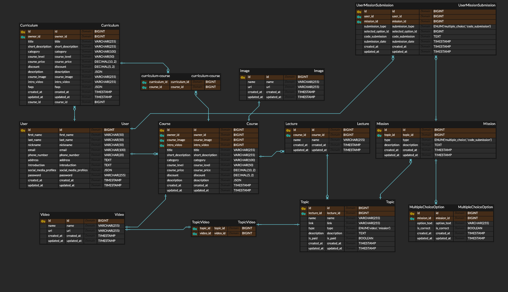
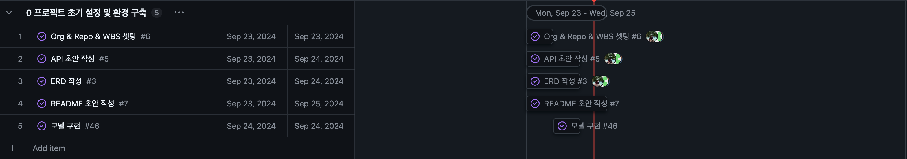
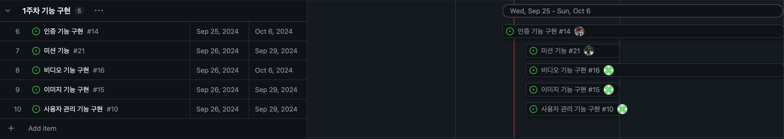
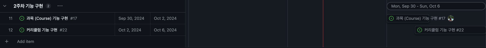
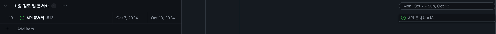

# WEAVERSE 프로젝트

WEAVERSE는 온라인 영상 교육 플랫폼을 구현하기 위한 프로젝트입니다.

## 팀 구성

| 이름   | 유원길                                                                                               | 임홍광                                                                                               | 이유정                                                                                                                                    |
| ------ | ---------------------------------------------------------------------------------------------------- | ---------------------------------------------------------------------------------------------------- | ----------------------------------------------------------------------------------------------------------------------------------------- |
| GitHub | [](https://github.com/nathanLYJ) | [](https://github.com/AlbertImKr) | [](https://github.com/devnproyj22) |
| 역할   | 팀원                                                                                                 | 팀원                                                                                                 | 팀장                                                                                                                                      |
| 담당   | 인증,인가                                                                                            | Course,Mission                                                                                       | 사용자,이미지,비디오                                                                                                                      |

## 기술 스택

### 언어


### 프레임워크 & 라이브러리

 

### 문서


## Local 실행 방법

1. DB설치(docker 실행)

```shell
docker compose up -d
```

2. 환경 변수 파일 추가 (.env 파일)

```
# SECRET_KEY
SECRET_KEY='django-insecure-da0mi_044pv-vs7-gpw8qb6t8=2czy@^er34_1^d'
# DEBUG
DEBUG=True
# DATABASE
DATABASE_ENGINE='django.db.backends.postgresql'
DATABASE_NAME='postgres'
DATABASE_USER='postgres'
DATABASE_PASSWORD='postgres'
DATABASE_HOST='localhost'
DATABASE_PORT='5432'
# ALLOWED_HOSTS
ALLOWED_HOSTS='*'
```

3. `pyenv`설치 및 활성화

```shell
# 가상환경 설치
python3 -m venv venv
# 활성화
source venv/bin/activate
```

또는

```shell
# 가상환경 설치
python -m venv venv
# 활성화
source venv/bin/activate
```

4. 필요한 패키지 설치

```
pip install -r requirements.txt
```

5. DB 마이그레이션

```shell
python manage.py migrate
```

6. 서버 실행

```shell
python manage.py runserver
```

## API 구조

- 사용자 인증: ✅
- 관리자 인증: 💻
- 오너 인증: 📦

### 인증 (Auth)

| 엔드포인트     | 메서드 | 설명                                     | 인증 |
| -------------- | ------ | ---------------------------------------- | ---- |
| `/api/login/`  | `POST` | 사용자가 로그인하고 토큰을 발급받습니다. |      |
| `/api/logout/` | `POST` | 사용자가 로그아웃합니다.                 |      |

### 사용자 (CustomUser)

#### 수강생

| 엔드포인트           | 메서드   | 설명                        | 인증     |
| -------------------- | -------- | --------------------------- | -------- |
| `/api/users/`        | `GET`    | 수강생 목록을 조회합니다.   | 💻       |
| `/api/users/`        | `POST`   | 새로운 수강생을 생성합니다. |          |
| `/api/users/{id}`    | `GET`    | 수강생 정보를 조회합니다.   | ✅,💻,📦 |
| `/api/users/{id}`    | `PUT`    | 수강생 정보를 수정합니다.   | 📦       |
| `/api/users/{id}`    | `DELETE` | 수강생가 탈퇴합니다.        | 📦       |
| `/api/users/counts/` | `GET`    | 총 수강생 수를 조회합니다.  | 📦       |

#### 강사진

| 엔드포인트       | 메서드 | 설명                        | 인증 |
| ---------------- | ------ | --------------------------- | ---- |
| `/api/managers/` | `GET`  | 관리자 목록을 조회합니다.   | 📦   |
| `/api/managers/` | `POST` | 새로운 관리자를 생성합니다. |      |

### 이미지 (Image)

| 엔드포인트                        | 메서드   | 설명                                   | 인증 |
| --------------------------------- | -------- | -------------------------------------- | ---- |
| `/api/managers/{id}/images/`      | `POST`   | 매니저가 새로운 이미지를 업로드합니다. | 📦   |
| `/api/managers/{id}/images/`      | `GET`    | 매니저의 모든 이미지를 가져옵니다.     | 📦   |
| `/api/managers/{id}/images/{id}/` | `GET`    | 매니저의 특정 이미지를 조회합니다.     | 📦   |
| `/api/managers/{id}/images/{id}/` | `DELETE` | 매니저의 특정 이미지를 삭제합니다.     | 📦   |

### 비디오 (Video)

| 엔드포인트          | 메서드   | 설명                          | 인증 |
| ------------------- | -------- | ----------------------------- | ---- |
| `/api/videos/`      | `POST`   | 새로운 비디오를 업로드합니다. | 📦   |
| `/api/videos/`      | `GET`    | 모든 비디오를 가져옵니다.     | 📦   |
| `/api/videos/{id}/` | `GET`    | 특정 비디오를 조회합니다.     | 📦   |
| `/api/videos/{id}/` | `DELETE` | 특정 비디오를 삭제합니다.     | 📦   |

### 특정 영상의 시청 기록 (Watch History for Specific Video)

| 엔드포인트                                            | 메서드   | 설명                                                       | 인증  |
| ----------------------------------------------------- | -------- | ---------------------------------------------------------- | ----- |
| `/api/users/{userId}/videos/{videoId}/watch-history/` | `PUT`    | 특정 영상의 시청 기록에 새 시청 기록을 추가합니다.         | 📦,💻 |
| `/api/users/{userId}/videos/{videoId}/watch-history/` | `DELETE` | 특정 영상의 시청 기록에서 특정 사용자의 기록을 삭제합니다. | 📦,💻 |

### 과목 (Course)

| 엔드포인트                    | 메서드   | 설명                             | 인증  |
| ----------------------------- | -------- | -------------------------------- | ----- |
| `/api/courses/`               | `POST`   | 새로운 과목을 생성합니다.        | 💻    |
| `/api/courses/{id}`           | `GET`    | 특정 과목 정보를 조회합니다.     | ✅,💻 |
| `/api/courses/{id}`           | `PUT`    | 과목 정보를 수정합니다.          | 💻    |
| `/api/courses/{id}`           | `DELETE` | 특정 과목을 삭제합니다.          | 💻    |
| `/api/courses/`               | `GET`    | 모든 과목 목록을 조회합니다.     | ✅    |
| `/api/courses/?name=..`       | `GET`    | 과목 이름으로 과목을 검색합니다. |       |
| `/api/courses/counts/`        | `GET`    | 총 과목 개수 조회합니다.         |       |
| `/api/courses/?category=..`   | `GET`    | 카테고리로 과목을 검색합니다.    |       |
| `/api/courses/?skilllevel=..` | `GET`    | skill level로 과목을 검색합니다. |       |
| `/api/courses/?pricelevel=..` | `GET`    | price level로 과목을 검색합니다. |       |

### 카테고리 (Category)

| 엔드포인트             | 메서드   | 설명                        | 인증 |
| ---------------------- | -------- | --------------------------- | ---- |
| `/api/categories/`     | `GET`    | 모든 카테고리를 조회합니다. |      |
| `/api/categories/`     | `POST`   | 카테고리를 생성합니다.      | 💻   |
| `/api/categories/{id}` | `GET`    | 개별 카테고리를 조회합니다. | 💻   |
| `/api/categories/{id}` | `PUT`    | 카테고리를 업데이트합니다.  | 💻   |
| `/api/categories/{id}` | `DELETE` | 카테고리를 삭제합니다.      | 💻   |

### 커리큘럼 (**Curriculum**)

| 엔드포인트              | 메서드   | 설명                             | 인증   |
| ----------------------- | -------- | -------------------------------- | ------ |
| `/api/curriculums/`     | `POST`   | 새로운 커리큘럼을 생성합니다.    | 💻     |
| `/api/curriculums/{id}` | `GET`    | 특정 커리큘럼 정보를 조회합니다. | 💻, ✅ |
| `/api/curriculums/{id}` | `PUT`    | 커리큘럼 정보를 수정합니다.      | 💻     |
| `/api/curriculums/{id}` | `DELETE` | 특정 커리큘럼을 삭제합니다.      | 💻     |
| `/api/curriculums/`     | `GET`    | 모든 커리큘럼 목록을 조회합니다. | ✅     |

### 수료증 (Certificates)

| 엔드포인트                                                   | 메서드   | 설명                               | 인증  |
| ------------------------------------------------------------ | -------- | ---------------------------------- | ----- |
| `/api/users/{userId}/certificates/`                          | `GET`    | 사용자의 수료증 목록을 조회합니다. | 📦,💻 |
| `/api/users/{userId}/certificates/{certificateId}/`          | `GET`    | 특정 수료증 정보를 조회합니다.     | 📦,💻 |
| `/api/users/{userId}/certificates/{certificateId}/download/` | `GET`    | 특정 수료증을 다운로드합니다.      | 📦,💻 |
| `/api/users/{userId}/certificates/`                          | `POST`   | 사용자가 수료증을 요청합니다.      | 📦    |
| `/api/users/{userId}/certificates/{certificateId}/`          | `DELETE` | 특정 수료증을 삭제합니다.          | 📦,💻 |

## ERD



## WBS

### 프로젝트 초기 설정 및 환경 구축



### 1주차 기능 구현



### 2주착 기능 구현



### 최종 검토 및 문서화


