# 프로젝트

## 소개
본 프로젝트는 온라인 영상 교육 플랫폼을 구현하기 위한 프로젝트입니다.

본 프로젝트의 목표는 온라인 영상 교육 플랫폼을 구축하여 사용자들에게 접근성 높은 ICT 교육 기회를 제공하고, 이를 통해 디지털 역량 강화와 경력 개발을 지원하는 비즈니스 가치를 창출하는 것입니다. 특히 웹 개발 나노 디그리 과정을 통해 실무 중심의 체계적인 학습 경험을 제공하고, 사용자 맞춤형 학습 관리 시스템으로 효과적인 학습을 도모하며, 결제 시스템 통합으로 수익 모델을 확립하는 것입니다. 

본 프로젝트명의 Weaverse는 Weave + Universe의 합성어로 Weave는 여러 ICT 과목들이 서로 연결되어 하나의 완성된 교육과정을 만드는 특성을, Universe는 플랫폼이 제공하는 다양한 학습 기회와 Resources를 상징하며 광범위하고 포괄적인 환경을 의미합니다. 여러분이 ICT 교육 프로그램을 통해 강좌에서 배운 ICT 내용을 통해 프로젝트에서 새로운 것을 만들어낼 수 있기를 바랍니다. 

## 일정
- 기간: 2024.09.23 ~ 2024.10.14 (22일)
- 주차별 일정:   
**1주차: 09.23 ~ 09.29**   
(09.23 ~ 09.25) 프로젝트 초기 설정 및 환경 구축, 기록 환경 구축  
(09.26 ~ 09.29) 기능 구현 1  
**2주차: 09.30 ~ 10.06**    
(09.30 ~ 10.6) 기능 구현 2
(09.30 ~ 10.6) 테스트 및 버그 수정  
**3주차: 10.07 ~ 10.13**    
(09.30 ~ 10.10) 기능 구현 3  
(09.30 ~ 10.10) 테스트 및 버그 수정  
(09.30 ~ 10.13) 프론트엔드 작업, 최종 검토 및 문서화  


## 사전 협의사항

### 1 개발 환경

#### 1-1 사용하는 기술 스택 (프론트엔드)

| 카테고리 | 영역 | 기술 |
|:----------:|:------:|:------|
| 프론트엔드 | JS 프레임워크 |  |
| 프론트엔드 | CSS 프레임워크 |  |
| 프론트엔드 | API 통신 |  |

#### 1-2 사용하는 기술 스택 (백엔드)

| 카테고리 | 영역 | 기술 |
|:----------:|:------:|:------|
| 백엔드 | 웹 프레임워크 |   |
| 백엔드 | 데이터베이스 |   |
| 백엔드 | API 개발 |   |
| 백엔드 | 서비스 배포 환경 |     |


#### 1-3 사용하는 기술 스택 (배포)

| 카테고리 | 영역 | 기술 |
|:----------:|:------:|:------|
| 자동화 | CI/CD |  |
| 문서화 | API 문서화 |  |

#### 1-4 사용하는 협업 툴

| 카테고리 | 영역 | 기술 |
|:----------:|:------:|:------|
| 협업툴 | 소통 |   |
| 협업툴 | 기록 |   |


##### **기록 환경**
* Project: WBS, GroundRule, Convention, 공유할 내용(링크, 개발환경, 공유파일 변경 내역), 회의록(TODO)
* Discussion: 안건, 토의 및 결론
* PR: 코드 리뷰 및 피드백
* Wiki: 주간 및 일일 회고록, Project & Discussion & PR 정리 블로그

#### 1-5 VS Code Extension
Black Formatter
isort
Docker
PostgreSQL
Thunder Client

#### 1-6 기본 및 써드 파티 라이브러리

1. 웹 프레임워크 및 REST API
```
CSRF
Django, djangorestframework: 웹 애플리케이션 개발 및 RESTful API 구현
django-cors-headers: 크로스 오리진 리소스 공유(CORS) 설정
django-filter: API 쿼리 필터링
drf-spectacular, drf-yasg: API 문서화
```

2. 데이터베이스 및 ORM
```
psycopg, psycopg-binary: PostgreSQL 데이터베이스 어댑터
```

3. 인증 및 권한
```
dj-rest-auth, django-allauth: 사용자 인증 및 등록
social-auth-app-django, social-auth-core: 소셜 미디어 인증
PyJWT: JSON Web Token 처리
```

4. 파일 및 미디어 처리
```
django-storages, boto3, botocore: AWS S3와 같은 클라우드 스토리지 통합
Pillow: 이미지 처리
django-video-encoding, ffmpeg, ffmpeg-python, ffprobe, moviepy: 비디오 처리 및 인코딩
opencv-python: 컴퓨터 비전 작업
```

5. 테스트 및 개발 도구
```
pytest, pytest-django: 테스트 프레임워크
model-bakery, Faker: 테스트 데이터 생성
mypy: 정적 타입 검사
django-seed: 데이터베이스 시드 데이터 생성
```

6. 유틸리티 및 헬퍼 라이브러리
```
python-dotenv: 환경 변수 관리
requests: HTTP 요청 처리
numpy: 수치 계산
tqdm: 진행 막대 표시
```

7. 서버 및 배포
```
gunicorn: WSGI HTTP 서버
```

8. 데이터 직렬화 및 스키마
```
PyYAML: YAML 파싱 및 생성
jsonschema: JSON 스키마 검증
```

9. 시간 및 날짜 처리
```
pytz: 시간대 처리
python-dateutil: 날짜 및 시간 유틸리티

```

### 2 아키텍쳐
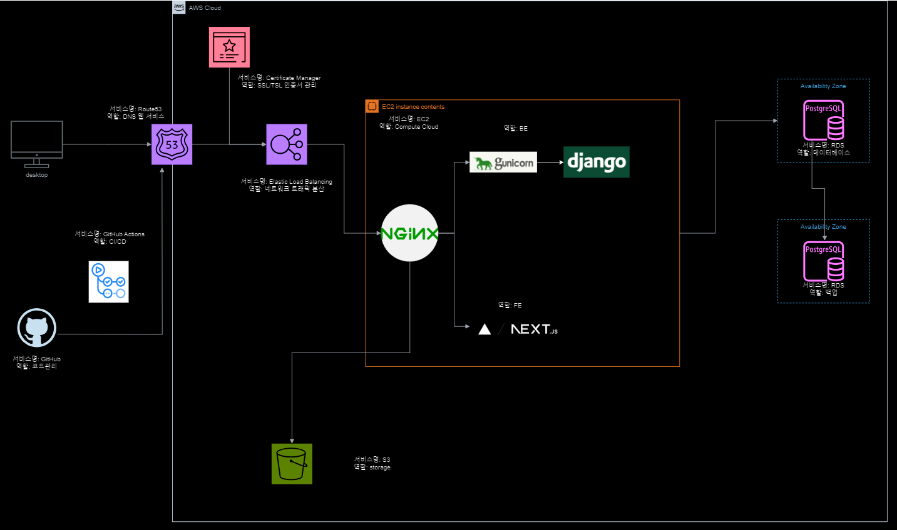


### 3 요구사항 명세

#### 3-1 기능적 요구사항

| 요구 기능 | 요구 기능 내용 | 구현 완료 |
|:-----------|:----------------|:---:|
| 1. 사용자 관리 (필수) | - 회원가입, 로그인/로그아웃 (사용자 및 관리자)<br>- 사용자 프로필 관리 (수료증, 학점, 학습 시간 등) | V |
| 2. 과목 관리 (필수) | - 7개 기본 과목 구성 (웹 개발 나노 디그리)<br>- 메인 페이지에 로드맵 표시 (결제 상태에 따른 색상 구분) | V |
| 3. 학습 진행 관리 | - 관리자 대시보드 (접속자 수, 결제 내역, 진행률 등)<br>- 학습자 대시보드 (개인 학습 진행 상황, 미션 현황) | V |
| 4. 동영상 학습 시스템 (필수) | - 비디오 스트리밍 기능 (기본 컨트롤, 진행률 표시, 이어보기) | V |
| 5. 미션 및 평가 시스템 (필수) | - 과목별 중간, 기말 미션 (5지선다형, 코드 제출형)<br>- 자동 채점 기능 | V |
| 6. 수료 인증 시스템 | - 디지털 수료증 발급 및 다운로드 | |
| 7. 결제 시스템 | - 다양한 결제 방식 지원<br>- 통합 결제 금액: 50,000원, 수강 기간 2년 | V |
| 8. ChatGPT 질문 응답 서비스 | - 강의 재생 화면에 챗봇 형태로 구현 | |

#### 3-2 비기능적 요구사항

| 요구 기능 | 요구 기능 내용 | 구현 완료 |
|:-----------|:----------------|:---:|
| 9. 비기능적 요구사항 | - 성능: 동시 접속자 100명 이상, 페이지 로딩 3초 이내<br>- 보안: 개인정보 암호화 저장<br>- 확장성: 새로운 과목 추가 용이, 서버 확장 고려<br>- 사용성: 위니브 부트캠프와 유사한 디자인 적용 | |
| 10. 데이터 요구사항 | - 사용자 정보, 학습 진행 상황, 결제 정보 등 저장 및 관리<br>- 정기적인 데이터 백업 | |


### 4 구현할 기능 명세

#### accounts
- 회원가입 R (수강생)
- 회원가입 R (수강생/강사/관리자) - 관리자 페이지
- 회원목록 R
- 회원정보 CRUD(소프트 삭제) (수강생)
- 회원정보 CRUD(소프트 삭제) (강사)
- 회원정보 CRUD(소프트 삭제) (수강생/강사/관리자) - 관리자 페이지

#### jwtauth
- 로그인
- 로그아웃 
- 로그인 토큰 C(RTR기반) (재발급)
- 로그인 토큰목록 보관(blacklist)
- 로그아웃 토큰목록 보관(blacklist)
- 소셜 로그인 연동

#### courses
- 과목목록 R
- 과목 CRUD(소프트 삭제)

#### materials
- 이미지 CRUD(검증 및 최적화)
- 이미지목록 R
- 영상 CUD(검증 및 최적화)
- 영상목록 R
- 영상기록 CUD
- 영상기록 R

#### payments
- 장바구니 RUD
- 장바구니목록 R
- 주문 CR
- 주문 청구주소 CRUD
- 주문 청구주소목록 R
- 주문 C
- 주문 결제 C (카카오페이 연동)
- 주문 환불 D (카카오페이 연동)
- 영수증 R
- 영수증목록 R


### 5 API 구조


#### 5-1 사용자 (accounts)

##### 수강생(student)

| 엔드포인트     | 메서드 | 설명                                     | 비인증 | 사용자 | 튜터 | 관리자 |
| :-------------- | :------: | :-----------------------------------| :--: | :--: | :--: | :--: |
| `/admin/` | `POST` | 수강생, 튜터, 관리자 회원가입|O|
| `/api/student/register/` | `POST`    | 수강생 회원가입        |O| 
| `/api/password/reset/` | `POST`    | 사용자 비밀번호 재설정     ||O|O|O|
| `/api/students/`        | `POST`   | 수강생 목록 조회          ||O|O|O|    
| `/api/students/{id}`    | `GET`    | 수강생 정보 조회        ||O|O|O|
| `/api/students/{id}`    | `PUT`    | 수강생 정보 전체수정    ||O|O|O|
| `/api/students/{id}`    | `PATCH`    | 수강생 정보 부분수정  ||O|O|O|
| `/api/students/{id}`    | `DELETE` | 수강생 탈퇴               ||O|O|O|

##### 강사(tutor)

| 엔드포인트     | 메서드 | 설명                                     | 비인증 | 사용자 | 튜터 | 관리자 |
| :-------------- | :------: | :-----------------------------------| :--: | :--: | :--: | :--: |
| `/api/tutors/` | `GET`  | 튜터 목록 조회   | | | |O|
| `/api/tutors/{id}/` | `GET` | 튜터 정보 조회 | | |O|O|
| `/api/tutors/{id}/` | `PUT` | 튜터 정보 전체수정 | | |O|O|
| `/api/tutors/{id}/` | `PATCH` | 튜터 정보 부분수정 | | |O|O|
| `/api/tutors/{id}/` | `DELETE` | 튜터 탈퇴 | | |O|O|


#### 5-2 인증 (jwtauth)

| 엔드포인트     | 메서드 | 설명                                     | 비인증 | 사용자 | 튜터 | 관리자 |
| :-------------- | :------: | :-----------------------------------| :--: | :--: | :--: | :--: |
| `/api/login/`  | `POST` | 사용자 로그인 및 토큰 발급      |O|      
| `/api/logout/` | `POST` | 사용자 로그아웃                ||O|O|O|
| `/api/refresh/` | `POST` | 사용자 refresh token 발급     |O|O|O|O|
| `/api/social-login/google/` | `GET` | 사용자 소셜 로그인 |O|                |      |

#### 5-3 과목 (course)

##### 커리큘럼 (**curriculum**)

| 엔드포인트     | 메서드 | 설명                                     | 비인증 | 사용자 | 튜터 | 관리자 |
| :-------------- | :------: | :-----------------------------------| :--: | :--: | :--: | :--: |
| `/api/curriculums/`     | `POST`  | 커리큘럼 생성                        |||O|O|
| `/api/curriculums/`     | `GET`   | 커리큘럼 목록 조회                   |||O|O|
| `/api/curriculums/{id}` | `GET`   | 커리큘럼 정보 조회                   |||O|O|
| `/api/curriculums/{id}` | `PUT`   | 커리큘럼 정보 전체수정               |||O|O|
| `/api/curriculums/{id}` | `DELETE`| 커리큘럼 정보 삭제                   |||O|O|

##### 과목

| 엔드포인트     | 메서드 | 설명                                     | 비인증 | 사용자 | 튜터 | 관리자 |
| :-------------- | :------: | :-----------------------------------| :--: | :--: | :--: | :--: |
| `/api/courses/`               | `POST`  | 과목 생성                          |||O|O|    
| `/api/courses/`               | `GET`   | 과목 목록 조회                     |O|O|O|O|
| `/api/courses/{id}`           | `GET`    | 과목 정보 조회                    |O|O|O|O|
| `/api/courses/{id}`           | `PUT`    | 과목 정보 전체수정                 |||O|O|
| `/api/courses/{id}`           | `DELETE` | 과목 정보 일부수정                 |||O|O|
| `/api/courses/?search=..`     | `GET`    | 과목 이름으로 과목 검색            |O|O|O|O|       
| `/api/courses/?category=..`   | `GET`    | 카테고리로 과목 검색               |O|O|O|O|   
| `/api/courses/?skilllevel=..` | `GET`    | skill level로 과목 검색           |O|O|O|O|    
| `/api/courses/?pricelevel=..` | `GET`    | price level로 과목 검색           |O|O|O|O|           

#### 5-4 자료 (materials)


##### 이미지 (image)

| 엔드포인트     | 메서드 | 설명                                     | 비인증 | 사용자 | 튜터 | 관리자 |
| :-------------- | :------: | :-----------------------------------| :--: | :--: | :--: | :--: |
| `/api/images/upload`| `POST`   | 사용자 이미지 생성                    ||O|O|O|
| `/api/images/`      | `GET`    | 사용자 이미지 목록 조회               ||O|O|O|
| `/api/images/{id}/` | `PUT`    | 사용자 이미지 정보 갱신               ||O|O|O|
| `/api/images/{id}/` | `DELETE` | 사용자 이미지 정보 삭제               ||O|O|O|

##### 동영상 (video)

| 엔드포인트     | 메서드 | 설명                                     | 비인증 | 사용자 | 튜터 | 관리자 |
| :-------------- | :------: | :-----------------------------------| :--: | :--: | :--: | :--: |
| `/api/videos/upload`| `POST`   | 관리자 동영상 생성                      ||||O|
| `/api/videos/`      | `GET`    | 관리자 동영상 목록 조회                ||||O|
| `/api/videos/{id}/` | `PUT`    | 관리자 동영상 정보 조회               ||||O|
| `/api/videos/{id}/` | `DELETE` | 관리자 동영상 정보 삭제               ||||O|

##### 동영상의 시청 기록 (watch history)

| 엔드포인트     | 메서드 | 설명                                     | 비인증 | 사용자 | 튜터 | 관리자 |
| :-------------- | :------: | :-----------------------------------| :--: | :--: | :--: | :--: |
| `/api/user/{user_id}/video/{video_id}/event-occur/` | `POST` | 동영상 시청 기록 생성               ||O|O|O|
| `/api/user/{user_id}/video/{video_id}/history/` | `GET` | 동영상 시청 기록 목록 조회                  ||||O|
| `/api/user/{user_id}/video/{video_id}/history/{event_id}` | `GET` | 동영상 시청 기록 정보 조회         ||||O|
| `/api/user/{user_id}/video/{video_id}/history/{event_id}` | `PUT` | 동영상 시청 기록 정보 전체수정     ||||O|
| `/api/user/{user_id}/video/{video_id}/history/{event_id}` | `PATCH` | 동영상 시청 기록 정보 부분수정   ||||O|
| `/api/user/{user_id}/video/{video_id}/history/{event_id}` | `DELETE` | 동영상 시청 기록 정보 삭제     ||||O|

#### 5-5 결제 (payments)

##### 장바구니(cart)

| 엔드포인트     | 메서드 | 설명                                     | 비인증 | 사용자 | 튜터 | 관리자 |
| :-------------- | :------: | :-----------------------------------| :--: | :--: | :--: | :--: |
| `/api/cart/`| `GET`  | 사용자 장바구니 목록 조회                              ||O|O|O|
| `/api/cart/{id}`| `GET`  | 사용자 장바구니 정보 조회                          ||O|O|O|
| `/api/cart/{id}`| `PUT`  | 사용자 장바구니 정보 전체수정                      ||O|O|O|
| `/api/cart/{id}`| `DELETE` | 사용자 장바구니 정보 삭제                       ||O|O|O|

##### 주문(order) 
| 엔드포인트     | 메서드 | 설명                                     | 비인증 | 사용자 | 튜터 | 관리자 |
| :-------------- | :------: | :-----------------------------------| :--: | :--: | :--: | :--: |
| `/api/orders/`| `POST` | 사용자 주문 생성                                   ||O|O|O|
| `/api/orders/`| `GET`  | 사용자 주문 정보 조회                              ||O|O|O|
| `/api/billing-addresses/`| `POST`| 사용자 주문 청구주소 생성                 ||O|O|O|
| `/api/billing-addresses/`| `GET` | 사용자 주문 청구주소 목록 조회            ||O|O|O|
| `/api/billing-addresses/{id}`| `GET` | 사용자 주문 청구주소 정보 조회        ||O|O|O| 
| `/api/billing-addresses/{id}`| `PUT` | 사용자 주문 청구주소 정보 전체수정    ||O|O|O|
| `/api/billing-addresses/{id}`| `DELETE` | 사용자 주문 청구주소 정보 삭제     ||O|O|O|
| `/api/payments/`| `POST` | 사용자 주문 결제 생성                            ||O|O|O|
| `/api/payments/`| `GET` | 사용자 주문 결제 조회 및 결제                     ||O|O|O|
| `/api/payments/{id}/cancel/`| `DELETE` | 사용자 주문 정보 삭제 및 환불      ||O|O|O|
| `/api/receipts/`| `GET`  | 사용자 주문 영수증 목록 조회                      ||O|O|O|
| `/api/receipts/{id}/`| `GET`  | 사용자 주문 영수증 목록 조회                 ||O|O|O|


### 6 데이터베이스 모델링(ERD)


### 7 와이어프레임

* 링크: [Weaverse-WireFrame](https://www.figma.com/board/9nmo3vsKy2YfRUo8KdzVrf/Weaverse?node-id=0-1&node-type=canvas&t=wDQiC8oTcgO9btQY-0)

| 사용 설명서 | 예시 |
|:--------:| :--------:| 
|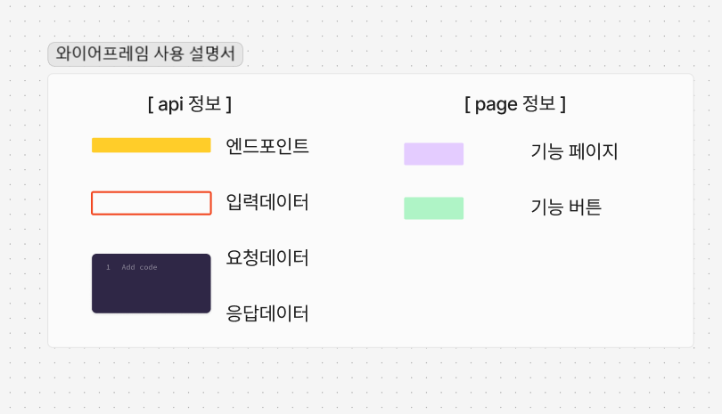|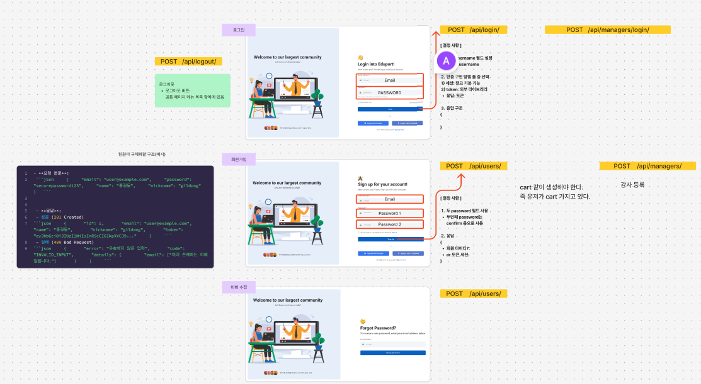|


### 8 WBS


### 프로젝트 초기 설정 및 환경 구축


### 1주차 기능 구현


### 2주차 기능 구현


#### 기능 내용
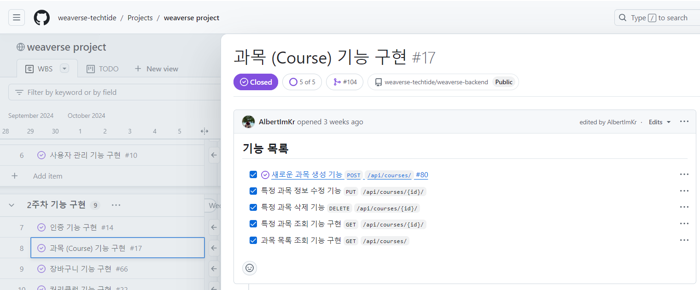

### 최종 검토 및 문서화


### 9 팀 구성 및 역할 분담

| 이름 | 이유정 | 유연우 | 유원길 | 임홍광 |
|------|--------|--------|--------|--------|
| GitHub | <a href="https://github.com/devnproyj22"></a> | <a href="https://github.com/Yoo117"></a> | <a href="https://github.com/nathanLYJ"></a> | <a href="https://github.com/AlbertImKr"></a> |
| 역할 | 팀장 | 팀원 | 팀원 | 팀원 |
| 담당 | 사용자, 자료 | 결제 | 인증 | 과목, FE |


#### 9-1 역할 분담 기준
* (우선) 필수 기능
* 안 해본 기능
* 흥미 있는 기능
* 기간 내 구현할 수 있는 기능

#### 9-2 뉴팀원에 대한 역할 분담 기준
* (추가) 중요 기능
* 기간 내 구현할 수 있는 기능

## 구현 단계

### 1 브랜치 생성 

각자 담당한 Issue로 브랜치 생성하여 각 앱 구현

### 2 PR로 코드 리뷰 및 작성

| 사용 설명서 | 예시 |
|:--------:| :--------:| 
|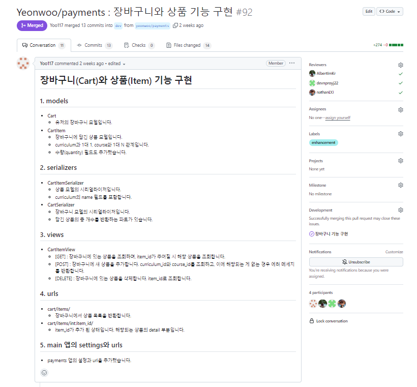|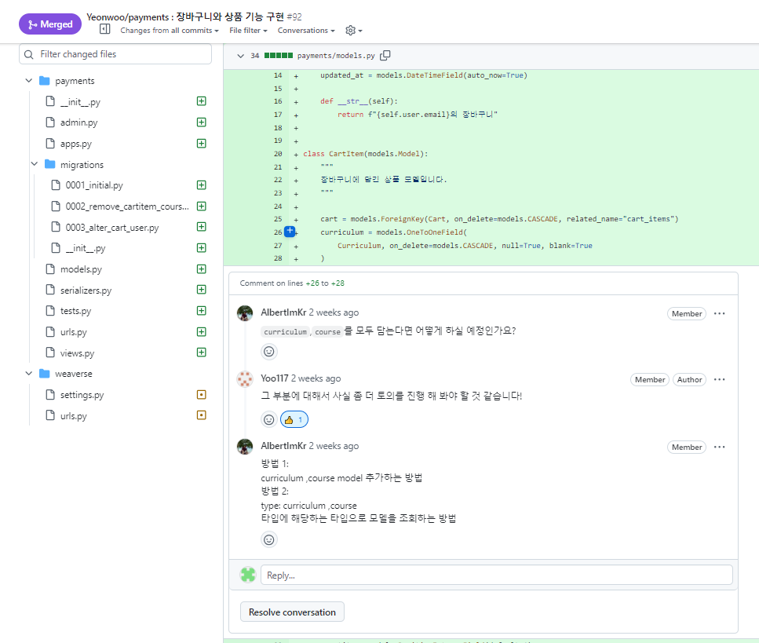|


PR을 올리기 전에 구현한 내용을 파일 목록 별로 설명을 작성하여 PR을 올립니다. 
각 팀원이 댓글로 피드백을 올리는 시간을 가졌습니다.
그리고 PR 올린 당사자가 코드 부분을 화면 공유하면서 전체적인 코드를 설명이 끝나면 
각 팀원이 피드백으로 질문을 하면서 진행하였습니다. 


### 3 중간 질문 및 토론

질문이나 선택할 부분이 생겼을 때 Discussion에 안건을 생성해 토의 후 결론지었습니다. 
결론을 내기 어렵거나 모르는 부분이 있는 토론은 멘토님이나 강사님과 함께 토론을 진행하였습니다. 


## 결과물

### 1 배포 도메인

[ 테스트용 관리자 계정 ]
```
아이디: test@example.com
비번: 24LMBPAaAgz4ZJw
```

- 프론트엔드 도메인: [www.weaverse.site/](www.weaverse.site/)
- 백엔드 도메인: [www.weaverse.site/api/](www.weaverse.site/api/)
- API 문서 도메인: [www.weaverse.site/schema/swagger-ui](www.weaverse.site/schema/swagger-ui)

#### 1-1 성능 테스트

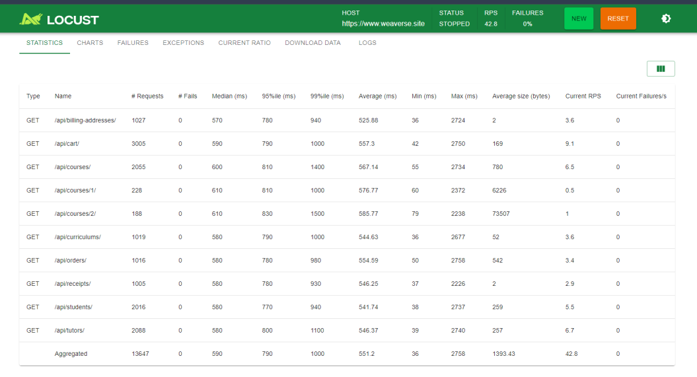

테스트에는 슈퍼계정의 에세스토큰으로 사용자의 데이터를 조회하는 방식으로 구현했습니다. 
데이터의 양은 많지않지만, 사이트에서 안정성 있게 기본 성능 테스트를 작성하였습니다. 

### 2 프로젝트 구조
<details><summary><strong>자세히 보기</strong></summary>

```
📦weaverse-backend
 ┣ 📂accounts
 ┃ ┣ 📂migrations
 ┃ ┣ 📂__pycache__
 ┃ ┣ 📂test
 ┃ ┃ ┣ 📜test_accounts_admin.py
 ┃ ┃ ┣ 📜test_accounts_models.py
 ┃ ┃ ┣ 📜test_accounts_permissions.py
 ┃ ┃ ┣ 📜test_accounts_serializers.py
 ┃ ┃ ┗ 📜test_accounts_views.py
 ┃ ┗ 📜__init__.py
 ┃ ┣ 📜admin.py
 ┃ ┣ 📜apps.py
 ┃ ┣ 📜models.py
 ┃ ┣ 📜serializers.py
 ┃ ┣ 📜urls.py
 ┃ ┗📜views.py
 ┣ 📂courses
 ┃ ┣ 📂migrations
 ┃ ┣ 📂test
 ┃ ┃ ┣ 📜conftest.py
 ┃ ┃ ┣ 📜test_mixins.py
 ┃ ┃ ┣ 📜test_models.py
 ┃ ┃ ┣ 📜test_permissions.py
 ┃ ┃ ┣ 📜test_serializers.py
 ┃ ┃ ┗ 📜test_views.py
 ┃ ┣ 📜__init__.py
 ┃ ┣ 📜admin.py
 ┃ ┣ 📜apps.py
 ┃ ┣ 📜mixins.py
 ┃ ┣ 📜models.py
 ┃ ┣ 📜permissions.py
 ┃ ┣ 📜serializers.py
 ┃ ┣ 📜urls.py
 ┃ ┗ 📜views.py
 ┣ 📂jwtauth
 ┃ ┣ 📂migrations
 ┃ ┣ 📂test
 ┃ ┃ ┗ 📜test_authentication.py
 ┃ ┣ 📜__init__.py
 ┃ ┣ 📜admin.py
 ┃ ┣ 📜apps.py
 ┃ ┣ 📜authentication.py
 ┃ ┣ 📜models.py
 ┃ ┣ 📜serializers.py
 ┃ ┣ 📜urls.py
 ┃ ┗ 📜views.py
 ┣ 📂materials
 ┃ ┣ 📂migrations
 ┃ ┣ 📜__init__.py
 ┃ ┣ 📜admin.py
 ┃ ┣ 📜apps.py
 ┃ ┣ 📜models.py
 ┃ ┣ 📜serializers.py
 ┃ ┣ 📜urls.py
 ┃ ┗ 📜views.py
 ┣ 📂payments
 ┃ ┣ 📂migrations
 ┃ ┣ 📂test
 ┃ ┃ ┣ 📜conftest.py
 ┃ ┃ ┣ 📜test_payments_mixins_and_services.py
 ┃ ┃ ┣ 📜test_payments_models.py
 ┃ ┃ ┣ 📜test_payments_models.py
 ┃ ┃ ┣ 📜test_serializers.py
 ┃ ┃ ┗ 📜test_views.py
 ┃ ┣ 📜__init__.py
 ┃ ┣ 📜admin.py
 ┃ ┣ 📜apps.py
 ┃ ┣ 📜mixins.py
 ┃ ┣ 📜models.py
 ┃ ┣ 📜permissions.py
 ┃ ┣ 📜serializers.py
 ┃ ┣ 📜services.py
 ┃ ┣ 📜urls.py
 ┃ ┗ 📜views.py
 ┣ 📂weaverse
 ┃ ┣ 📜__init__.py
 ┃ ┣ 📜asgi.py
 ┃ ┣ 📜settings.py
 ┃ ┣ 📜urls.py
 ┃ ┗ 📜wsgi.py 
 ┣ 📜.gitignore
 ┣ 📜docker-compose.yml
 ┣ 📜manage.py
 ┣ 📜README.md
 ┗ 📜requirements.txt
```
</details>


### 3 구현된 화면
- 피그마를 사용해 화면 연결
- 각 앱별로 표를 작성


### 4 구현된 기능
- .gif 시연 영상

#### 4-1 회원가입
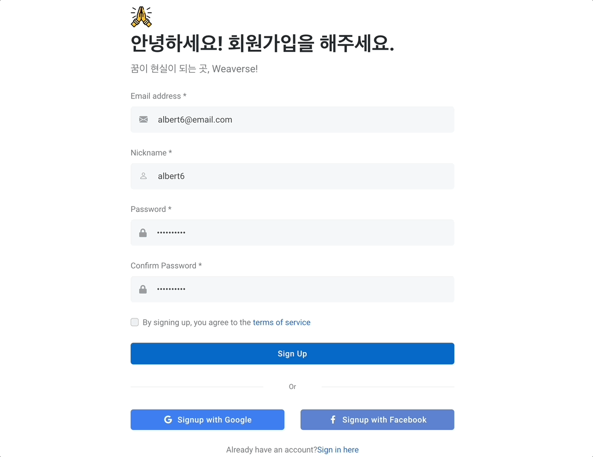

#### 4-2 로그인 


#### 4-3 로그아웃 
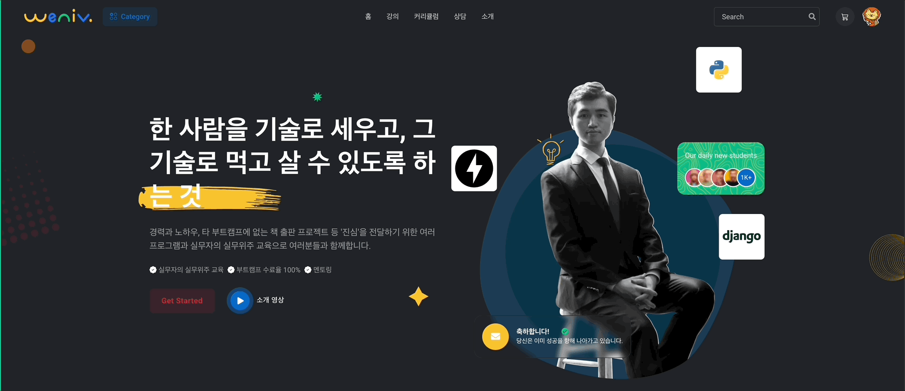

#### 4-4 코스 생성 


- 이미지 및 동영상 업로드/다운로드

#### 4-5 코스 조회

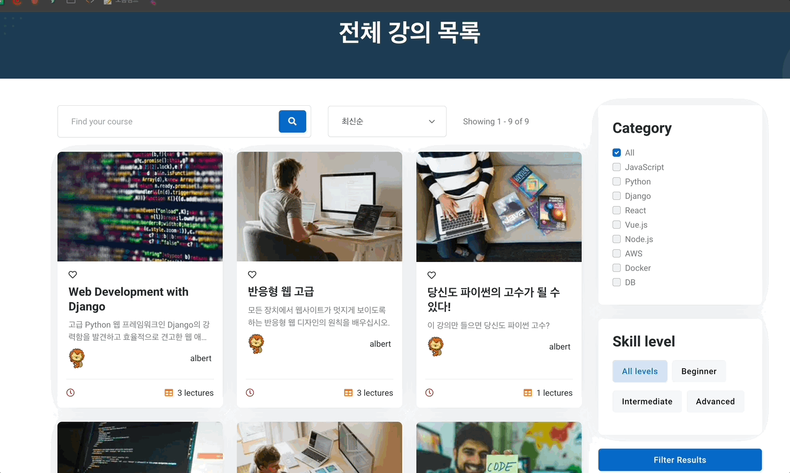

- 이미지 및 동영상 업로드/다운로드

#### 4-6 장바구니 


#### 4-7 상품 결제
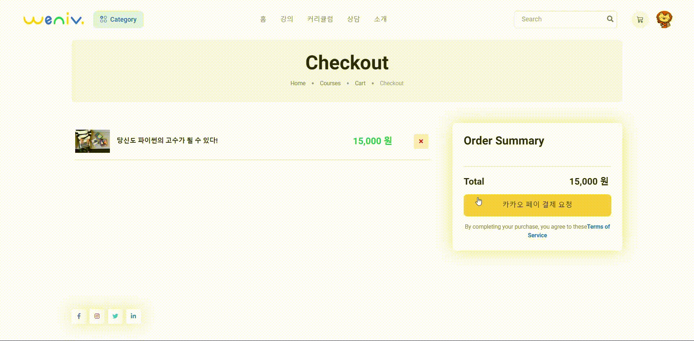


### 5 테스트 케이스

[ 테스트 환경 ]
```
- 테스트 데이터베이스: PostgreSQL 사용
- 테스트 데이터: app/conftest.py 안 pytest fixtures를 사용하여 공통 내용 정의 및 객체 생성
- 테스트 위치: 각 app/test 디렉토리 
- 테스트 패턴: 테스트의 준비, 실행, 검증 단계를 명확히 구분
- 테스트 자동화: (실행 주기) Commit, Pull Request, 정기적으로 매주말 (트리거방식) CI/CD 파이프라인과 연동
```
기본 설정은 데코레이터를 사용한 픽스처(@pytest.fixture), 마킹(@pytest.mark)를 사용했습니다.
테스트 데이터는 실제 데이터베이스와 격리된 환경에서 생성되므로, 테스트가 독립적으로 생성하여 실행하였습니다. 
테스트 케이스를 작성할 때는 assert 구문을 사용해서 각 앱안 파일별 기능에 대한 간결하며 직관적으로 작성했습니다.

PR에서 다른 앱에서 발생한 테스트도 함께 볼 수 있게 하였습니다. 


[ 테스트 주요 영역 ]
```
1. 모델
2. 시리얼라이저
3. 뷰 (API 엔드포인트)
4. 권한 클래스
```


[ 테스트 케이스 내용 ]
```
앱별 테스트 케이스를 작성하여
- 각 앱 관리 기능의 정확성 검증
- 권한 및 인증 로직의 올바른 동작 확인
- API 엔드포인트의 정상 작동 확인
- 모델, 시리얼라이저, 뷰의 기능 검증
```

[ 테스트 결과 보고, 분석 및 조치 ]
```
  1. 실패한 테스트 케이스 확인
  2. 오류 메시지 및 스택 트레이스 분석: 장고 코드에 디버깅 정보 출력
  3. 필요한 경우 해당 부분 코드 리뷰 및 수정
  4. 수정 후 다시 테스트 진행
```


## 토론했던 내용(시행 착오)

선택지들의 tradeoff(장단점)을 토의 후 결정하였습니다. 

### [ 장고 코드 구조 ]

#### [1] 앱을 어떻게 분리했는지, 그 이유는 무엇인지?

결론: 사용자 계정, 인증, 과목, 결제, 자료를 분리하여 독립적인 앱을 만들었습니다. 

선택이유:

앱이 많아질수록 프로젝트의 전반적인 구조가 복잡해져서 관리가 어려울 수 있고 서로 다른 앱 간 데이터나 로직을 공유해야 할 경우 의존성 관리가 까다로울 수 있지만 각 앱은 독립적 모듈로 작동하여 다른 프로젝트에서 재사용할 수 하기 위해서 선택하였습니다. 


#### [2] 모델, 시리얼라이저와 뷰의 역할 구분은 어떻게 했는지, 그 이유는 무엇인지?

결론: 모델은 필드, 관계, 특정 값 연산(예. 객체 수 등 값) 로직, 시리얼라이저는 유효성 검사, 직렬화/역직렬화, 뷰는 그외 비즈니스 로직(예. 최적화), 요청 및 응답 처리하는 역할로 구분하였습니다..

선택이유:

장고 코드를 참고하여 장고 철학을 반영하려고 하였고 각 앱의 파일 내용을 통일해서 가독성를 높였습니다.  


```python
# 시리얼라이저에 로직을 넣는 경우
class UserSerializer(serializers.ModelSerializer):
    def validate_email(self, value):
        if User.objects.filter(email=value).exists():
            raise serializers.ValidationError("이미 존재하는 이메일입니다.")
        return value

# 뷰에 로직을 넣는 경우
class UserCreateView(generics.CreateAPIView):
    def perform_create(self, serializer):
        user = serializer.save()
        send_welcome_email(user.email)
```
 

#### [3] 일반 시리얼라이저, 모델 시리얼라이저 중 어떤 것을 사용했는지, 그 이유는 무엇인지?

결론: 모델의 필드가 필요한 처리일 경우는 모델 시리얼라이저로, 쓰고 삭제할 필드가 필요한 처리일 경우에는 시리얼라이저를 사용했습니다. 

선택 이유:

모델과 1:1로 매핑되는 경우 모델 시리얼라이저를 사용하면, 한번 쓸 필드인 경우 시리얼라이저를 사용하면 코드가 간결해졌습니다. 


#### [4] 뷰 클래스 중 어떤 것을 사용했는지, 그 이유는 무엇인지?

결론: 구체적이고 명시적으로 알 수 있기에 중간단계인 Generics.APIView와 Mixin을 사용하였습니다. 

선택이유:

추상화와 중복성을 고려하여 선택하였습니다. 

### [ 인증 ]

#### [5] 인증할때 세션과 토큰 중 어느 것을 사용했는지, 그 이유는 무엇인지?


**결정:**
  - **JWT 토큰 인증** 방식을 사용하기로 결정

**결정 이유**: 
  1. **서버 부하 최소화**: 상태를 유지하지 않아 서버 리소스 소모가 적습니다.
  2. **효율적인 네트워크 사용**: 인증에 필요한 정보의 양이 적고, 추가적인 부하 증가 우려가 크지 않습니다.
  3. **토큰 만료 관리**: 토큰 수명 설정과 Blacklist 모델을 통해 효과적으로 관리할 수 있습니다.
  4. **확장성**: 마이크로서비스 아키텍처에 적합하며, 이는 좋은 개발 경험을 제공할 수 있습니다.
  5. **보안 강화**: XSS와 같은 보안 위협에 대비하기 위해, 토큰은 **Cookies**에 저장하여 전송할 계획입니다.


#### [6] 토큰 만료는 어떻게 처리했는지, 그 이유는 무엇인지?

**결정:**
  - **Refresh Token Rotation** 방식을 사용하기로 결정


**결정 이유**:  

**RTR(Refresh Token Rotation)**는 만료된 JWT 토큰을 처리하고 새 토큰을 발급하는 방식으로, 보안을 강화하는 데 중요한 방법 중 하나입니다. JWT 인증에서 **토큰 만료 처리**와 **토큰 갱신**이 중요한 이슈인데, 이 문제를 해결하는 하나의 전략이 **Refresh Token Rotation**입니다. 

  1. **보안성 강화**: Refresh Token를 한 번 사용할 때마다 새로운 토큰을 발급하여, 도난된 토큰의 재사용을 방지할 수 있습니다.
  2. **토큰 탈취 위험 감소**: 누군가 Refresh Token를 탈취해도, 그 토큰은 이미 만료된 상태일 가능성이 크기 때문에 보안 위협을 줄일 수 있습니다.
  3. **긴 세션 유지**: 짧은 Access Token의 수명을 유지하면서도, Refresh Token를 통해 사용자가 지속적으로 인증 상태를 유지할 수 있습니다.

### [ 데이터 전달 ]

#### [7] fetch를 몇변 할 것인지, 그 이유는 무엇인지?

**예시**:
- 코스 목록과 상세 정보를 별도로 요청
- 코스와 관련된 모든 정보를 한 번에 요청

결론: 성능을 위해서 관련된 모든 정보를 한 번에 요청하기로 선택했습니다. 

선택이유:

데이터의 크기, 사용 빈도, 프론트엔드의 구조 등을 고려하여 결정했습니다.

#### [8] 트랜잭션을 어떻게 처리했는지, 그 이유는 무엇인지?

**예시**:
```python
from django.db import transaction

@transaction.atomic
def create_order(user, cart):
    order = Order.objects.create(user=user)
    for item in cart.items.all():
        OrderItem.objects.create(order=order, product=item.product, quantity=item.quantity)
    cart.clear()
    return order
```

**결론**: 같은 데이터 대상에 대한 여러 단계의 데이터베이스 작업이 모두 성공하거나 모두 실패해야 하는 경우 트랜잭션을 사용했습니다

#### [9] 테스트는 어떤 라이브러리를 사용할 것이지, 그 이유는 무엇인지? 

**결론**
- 데코레이터를 활용한 마킹(@pytest.mark) 등으로 테스트를 체계적으로 관리
- 강력한 피처와 플러그인 생태계
- 우수한 에러 메시지와 디버깅 지원
- Fixture 시스템

- 각 앱별로 테스트 케이스 작성은?

: 각 앱의 주요 기능과 비즈니스 로직을 테스트하고, 코드 변경 시 테스트 케이스를 실행하여 기능이 올바르게 작동하는지 확인하기 위해 앱별로 테스트 케이스를 작성했습니다.

#### [10] 중복되는 에러 메시지는 어떻게 할 것인지, 그 이유는 무엇인지?

결론: 중복을 피하기 위해서, get object or 404 등 에러메시지 상속(mixin)에서 구현하였습니다. 

**예시**:
```python
class GetObjectOr404Mixin:
    def get_object_or_404(self, queryset, *filter_args, **filter_kwargs):
        try:
            return get_object_or_404(queryset, *filter_args, **filter_kwargs)
        except Http404:
            raise NotFound(detail="요청한 객체를 찾을 수 없습니다.")
```

#### [11] 결제에서 발생하는 비동기 처리는 어떻게 할 것인지, 그 이유는 무엇인지? 
<비동기 결제 처리 개선>

결론: @transaction.atomic와 select for update을 사용하여 한번에 처리하였습니다. 

이러한 문제를 해결하기 위해, 우리는 비동기 방식으로 결제 처리를 재설계하였습니다. 비동기 결제 처리 방식을 도입함으로써 결제 처리 로직이 더욱 간소화되었으며, 코드의 가독성도 개선되었습니다. 이와 동시에, 결제 처리의 보안성이 강화되어 중복 결제와 같은 잠재적 위험 요소를 효과적으로 줄일 수 있었습니다. 이와 같은 개선 사항을 통해 사용자에게 보다 안정적이고 효율적인 결제 경험을 제공할 수 있게 되었습니다.

선택 이유:
원래 결제 처리 로직은 중간중간 예외 처리를 추가하여 중복 결제를 방지하려 했습니다. 그러나 온라인 강의라는 상품의 특성상 상품 수량 제한으로 인해 오류가 발생할 가능성이 적었고, 이러한 예외 처리 로직이 서버의 최적화를 저해할 것이라는 판단이 들었습니다. 이에 따라 예외 처리를 제거하였으나, 코드 리뷰 과정에서 예외 처리 구문이 결제 처리 코드의 길이를 증가시키고 실제로 결제 과중 상황에서 중복 결제를 방지하지 못한다는 피드백을 받았습니다.


### [ 총평 ]

- 독립적인 앱 연결: 
이름 수정 => 나머지 코드 수정 방법?
=> 자주 수정할 때 생기는 에러 

한 앱에서 수정했을 때 다른 앱에서도 변경
- BE 문서화: schema 를 상세히 작성하지 못했고
- BE 테스트: 구체적인 에러 유형별 확인 못함, 독립적인 앱 연결 -> TDD
- FE 빨리 시작: 늦은 시작, 시간 촉박


## 겪었던 에러
#### 필드값 공백으로 일어난 문제
**예시**: 
```python
class User(models.Model):
    email = models.EmailField(unique=True, blank=True)  # blank=True가 문제
```

**해결**: `blank=False`로 설정하고, 폼 검증 로직 추가

#### 구현한 에러의 종류와 테스트 코드에서 확인
**예시**:
```python
def test_invalid_email_format(self):
    data = {"email": "invalid_email", "password": "password123"}
    response = self.client.post('/api/register/', data)
    self.assertEqual(response.status_code, status.HTTP_400_BAD_REQUEST)
    self.assertIn('email', response.data)
```

#### 라이브러리 충돌
**문제**: Django 버전과 JWT 라이브러리 호환성 문제

**해결**: 
1. PyJWT 버전로 교체

**문제**: JWT와 PyJWT 버전 충돌, Encoding 오류 발생.

**해결**:
1. JWT와 PyJWT 모두 삭제, PyJWT 만 다시 설치

#### FE 에러
**예시**: CORS 설정 문제로 인한 API 호출 실패

**해결**:
```python
CORS_ALLOWED_ORIGINS = [
    "http://localhost:3000",
    "https://XXX.com",
]
```

## 느낀점과 배운점

### [ 총평 ]

#### 느낀점과 배운 점
설계부터 구현, 배포까지 전체적인 흐름을 알 수 있었고, 
써드 파티 라이브러리와 다른 API(카카오결제), AWS를 익힐 수 있었습니다. 

#### 아쉬웠던 점 
- 한 앱에서 수정했을 때 다른 앱에서도 변경해야 했기에 에러가 많이 발생했습니다. 
예를 들어, 독립적인 앱 연결: 이름 수정 => 나머지 코드 수정이 필요했습니다. 
- BE 문서화: schema 를 상세히 작성하지 못했고
- BE 테스트: 구체적인 에러 유형별 확인 못함, 독립적인 앱 연결 -> TDD
- FE 빨리 시작: 늦은 시작, 시간 촉박


## 개별 회고(느낀점과 배운점)

유정님

프로젝트를 진행하는 3주 동안 팀장 역할을 맡으면서 그때 그때 기록의 중요성, README의 종요성,
팀 안의 소통의 중요성, 선택지에 대한 trade-off의 중요성, WBS를 빠르게 파악하고 기한 내에 구현하는 것의 중요성과 같은 많은 깨달음을 얻게 된 좋은 경험이었습니다. 특히, 성장은 혼자가 아닌 같이 함께 문제를 해결해가면서 하는 것임을 배웠고 배움에 있어 관점이 많이 달라진 계기가 되었습니다. 팀장은 처음이라 서투른 면이 많았는데 팀원들이 많이 도와주셔서 완주할 수 있었습니다.  연우님, 원길님, 홍광님 감사합니다. 

연우님

 지난 3주 동안 많은 것을 배울 수 있는 뜻깊은 시간이였다고 생각합니다. 단순히 혼자서 독자노선으로 개발하는 것이 중요한 것이 아니며, 팀원들과의 조율 및 커뮤니케이션이 작업 능률에 얼마나 영향을 끼치는 지 알게 되었습니다. 처음 해보는 협업 프로젝트라 많이 서투른 점도 있고 힘들었지만, 오히려 실무 전에 이런 중요한 경험을 해보게 되어 정말 다행이라고도 생각이 듭니다. 우리 팀원들 그리고 팀장님! 정말 고생 많으셨습니다.

원길님

프로젝트를 진행하면서 팀원들과의 협업을 통해 많은 것을 배울 수 있었습니다.
특히, 코드 리뷰를 통해 서로의 코드를 검토하고 피드백을 주고받는 과정이 매우 유익했습니다.
프로젝트를 통해 새로운 기술을 배우고, 이를 실제로 적용해보는 경험은 매우 중요하다고 느꼈습니다.
저는 인증관련 기능을 구현하면서 JWT 토큰 인증 방식에 대해 자세히 공부할 수 있었습니다.
이번 프로젝트를 BDD 방식으로 진행하면서 계획의 중용성와 어려움 동시에 느낄 수 있었습니다. 탄탄한 계획 바탕으로
코딩을 시작하면 효율적으로 작업을 진행할 수 있었습니다, 이해도가 부족한 부분도 많았지만, 팀원들과의 협업을 통해 많은 것을 채워나갈 수 있었습니다.

홍광님

이번 프로젝트에서 BE와 함께 FE도 담당하게 되었고 익숙하지 않은 Next.js로 FE를 구현하는 도전을 했습니다. 간단히 구현할 수 있을 거라 생각했지만, 일정 관리에 실패해 아쉬움이 남았습니다. 익숙하지 않은 기술에 대해서는 일정에 더 여유를 두거나 사전 학습을 통해 준비하는 것이 중요하다는 교훈을 얻었습니다.

또한 Django 로직이 복잡해지면서 코드에 대한 고민이 많아졌고 이를 통해 많은 것을 배웠습니다. 회고를 통해 고민한 내용을 정리하고 이후 사이드 프로젝트에서 이러한 부분을 더 깊이 탐구하며 성장할 수 있을 것 같습니다.
